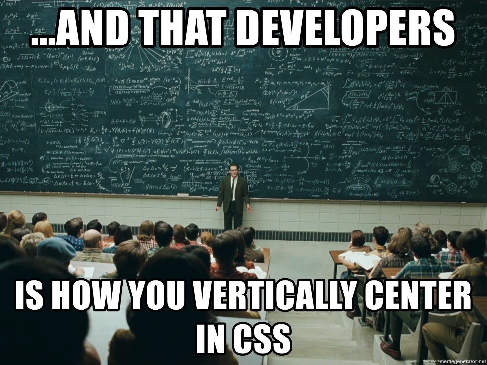

# Boas vindas ao repositório do projeto de CSS Responsivo!

# Sumário

- [O que vamos aprender?](#-o-que-vamos-aprender)
- [Você será capaz de](#voce-sera-capaz-de)
- [Porque isso é importante?](#porque-isso-e-importante)
- [Conteúdos](#conteudos)
  - [Unidades absolutas e relativas](#unidade-absolutas-e-relativas)
    - [Introdução](#introducao-units)
    - [Mão na massa](#mao-na-massa-units)
  - [CSS Grid](#css-grid)
    - [Introdução](#introducao-grid)
    - [Mão na massa](#mao-na-massa-grid)
- [Vamos praticar!](#vamos-praticar)
- [Recursos Adicionais](#recursos-adicionais)

* * *

## O que vamos aprender?

Nesse projeto iremos desenvolver a capacidade de construir layouts utilizando a ténica que é disponibilizada através do modo de grade(grid), aprender sobre posicionamentos, e com a utilização das media queries para criarmos layouts que sejam complexos porém com facilidade e consistência entre os navegadores.

Siga as instruções indicadas nos arquivos junto com o material de referência para entendimento do conteúdo.

### Antes de começar a desenvolver:

Você possui duas opções: 
- Realizar um clone do repositório e realizar um `push`.
- Realizar um `fork` deste repositório. (Caso queira consigo acompanhar mais facilmente caso tenha alguma dificuldade.)

* * *

### Iremos exercitar os seguinte conceitos

- Utilizar unidades corretas e fluidas para facilitar layouts responsivos.
- Utilizar `CSS Grid` para realizar layouts complexos.
- Utilizar a técnica mobile-first e as media queries para se adaptar com dispositivos gerais.
- Juntar os conceitos aplicados relacionado á resposnvidade em uma aplicação.

* * *

## Conteudos

Vamos nos aprofundar na mágia do CSS \o/.
É muito importante praticar cada tópico para entendimento pois a junção de todos garante a melhor flexibilidade para o CSS responsivo acontecer.

### Unidades absolutas e relativas

#### Introdução <a id="introducao-units"></a>

Você já deve ter percebido que no desenvolvimento web, trabalhamos com bastante unidade de medidas. O príncipio na responsividade é trabalharmos com unidades relativas, pois elas oferecem melhor flexibilidade para construir nosso layout. Mas vamos entender cada uma que podemos utilizar em nossa aplicação.

##### Unidades absolutas

> cm, mm, Q, in, pc, pt, px

Unidades absolutas não mudam pois não são relativas ao qualquer elemento pré-definido, e sempre serão o mesmo tamanho ao qual foi definido. A opção mais comum será a unidade `px`.

##### Unidades relativas

> em, ex, ch, rem, lh, vw, vh, vmin, vmax

Unidades relativas dependem de algo pré-definido, seja um elemento pai ou largura/altura disponível do dispositivo que a aplicação está sendo utilizada. 
Iremos nos aprofundar sobre `em`, `rem`, `vh` e `vw`.

Medidas relativas servem para facilitar o desenvolvimento com os diversos dispositivos que temos atualmente.

#### Mão na massa! <a id="mao-na-massa-units"></a>

Verifique o arquivo `units/index.html` e realize as mudanças conforme indicadas nos comentários com `NOTE`.

Unidades que você irá utilizar e suas abordagens:
- **px**: Relacionado á 1 pixel da tela do dispositivo
- **em**: Relacionado ao tamanho da fonte do elemento pai.
- **rem**: Relacionado ao tamanho da fonte do `html`, o padrão é `16px`.
- **vh**: Relacionado á 1% da altura do dispositivo.
- **vw**: Relacionado á 1% da largura do dispositivo.

Após a realização, redimensione a janela e perceba a diferença entre como os valores absolutos e relativos reagem em relação ao espaço disponível.

Um ponto importante é perceber que `em` se relaciona somente com a div anterior, vimos que na sua primeira definição da classe foi deifnido `14px` ou seja, `2em` resulta em `28px` e `3em` resulta `56px`, enquanto `rem` só se preocupa em relação ao que foi definido no `html`, por padrão é 16px

[](assets/fontsize.gif 'Gif mostrando tamanho da fonte padrão no navegador através do dev tools')

* * *

### CSS Grid

#### Introdução <a id="introducao-grid"></a>

Antigamente um dos maiores desafios relacionado ao desenvolvimento web se tratava na construção de layouts, conforme o tempo foi avançado várias abordagens (~~hoje isso se chama gambiarra~~) foram sendo utilizadas, tendo métodos desde da utilização com [tabelas](hhttps://www.tutorialrepublic.com/codelab.php?topic=html&file=table-layout), [floats](https://www.tutorialrepublic.com/codelab.php?topic=html5&file=semantic-website-layout), com a propriedade `position` e `display block`, `inline-block` e assim por diante. 
Agora imagine o trabalho não só para construir mas para quando quisesse fazer alguma alteração no layout, a responsabilidade poderia estar no elemento HTML ou divido em várias seções no CSS, com isso tudo foi gerado a grande fama de dificuldade que se tem como trabalhar com CSS.

<div align="center">

[](assets/meme-css-center.jpg 'Meme CSS')

</div>

Mas queremos aqui, que você venha dar uma chance para nossas aplicações estarem bonitas (~~e com isso você não perder nenhum fio de cabelo~~). 
Hoje em dia já possuímos o método de layout através [flexbox](https://css-tricks.com/snippets/css/a-guide-to-flexbox/), que foi um divisor na web em relação aos métodos passados com criação de layout, mas algo em relação a diferença do grid está no seguinte fator:
- Flexbox: **Unidirecional**, *tratamos somente um eixo, somente horizontal ou vertical, ele é baseado no conteúdo dos itens* (a definição do tamanho do item, é definido no próprio item)
- Grid: **Bidrecional**, *conseguimos tratar os dois eixos horizontal e vertical, ele é baseado na definição do container* (a definição do tamanho dos itens, é feito no elemento pai)

> [Exemplo sobre a explicação acima](https://x-team.com/blog/css-grid-vs-flexbox/)

Caso tenha dúvida, lembre-se:
- Quero tratar somente linha ou coluna: Utilize `display: flex`
- Quero controlar linha e coluna: Utilize `display: grid` 

Nada te impede de utilzar o grid caso queira tratar somente linha ou coluna (_priorize sempre em simplificar seu código_ 😃), mas o conteúdo abordado será focado exclusivamente na utilização do `display: grid`

* * *

#### Conceitos Fundamentais

##### 01 - Fundamentos

- Todos nodes filhos de um elemento com display:grid, sempre irão ser items de grid explicitamente
- A declaração direta é chamada de implicit grid
- Os números em relação ao grid não significa a coluna em si, mas sim o começo e aonde termina

```html

<section class="container"> <!-- Elemento com grid aplicado -->
    <article></article> <!-- Item do grid -->
    <article></article> <!-- Item do grid -->
    <article></article> <!-- Item do grid -->
</section>

```

```css
 .exemplo {
    display:grid;
 }
```

##### 02 - Implicito X Explicito

- O modo explicito acontece quando há declaração EXATAMENTE do que o elemento precisa distribuir para os itens do grid.
- O modo implicito acontece quando o navegador precisa alocar um item extra, e já foi ocupado toda a definição anterior. Exemplo: 5 itens com somente duas colunas, uma linha extra será criada. Então, a implicidade ocorre no momento da criação da segunda linha
(grid-row) para encaixar os elementos.
- O tamanho gerado por padrão da implicidade é `1fr`, porém pode ser manipulada com auto-rows/columns.

```css
 .exemplo {
    display:grid;
    grid-template-columns: 1fr 100px;
    grid-auto-rows: 250px;
 }
```

##### 03 - Auto Flow

- O auto flow controla onde a implicidade anterior ocorre, determina se o elemento extra irá se ajuntar como uma nova coluna ou linha do grid.
- Por padrão, ele sempre irá adicionar uma nova linha para ocorrer a implicidade.

```css
 .exemplo {
    display:grid;
    grid-auto-flow: column;
    grid-auto-columns: 1fr;
    grid-template-rows: 1fr;
    /* Será somente uma linha, os novos itens irão surgir como uma nova coluna */
 }
```

##### 04 - Definição de tamanhos

- Não utilize a definição do grid com %,
- Porque a porcentagem é relacionado ao algo que tenha como pai algo pré-definido
> container pai como width: 100vw, no node filho pode-se usar 50% (50vw)
- Opte pelas medidas de frações, pois elas realizam o calculo automatico para nós
- A definição do grid-auto-rows por padrão é 1fr ao declarar o display: grid
- A propriedade `auto` ocupa somente o espaço restante referente aos calculos dado.
- A propriedade gap serve para criar espaçamento entre os itens da coluna.

[Vídeo explicativo sobre o conceito de utilizar fr](https://www.youtube.com/watch?v=Dp7kOWhAjuo)

```css
 .exemplo {
    display:grid;
    grid-template-columns: 2fr auto 200px;
    /*  podemos combinar a utilização com outros valores */
 }
```

##### 05 - Repeat

- A função repeat evita repetição desnecessária em relação a quantidade de elementos definidos
- Podemos utilizar da melhor forma que for convecional ao código.
> coluna: grid-column / linha: grid-row

```css
 .exemplo {
    display:grid;
    grid-template-columns: 2fr repeat(3, 1fr auto) 200px;
    grid-template-rows: repeat(2, 1fr);
    /*  
    grid-template-columns: 2fr 1fr auto 1fr auto 1fr auto 200px;
    grid-template-rows: 1fr 1fr;
    */
 }
```
##### 06 - Tamanho de itens do grid

- Não podemos definir o width explicito (500px) no grid item, pois todos os itens são afetados pela explicidade
- Para alterar a quantidade de colunas/linhas ocupadas, utilizamos a propriedade span e logo em seguida a quantidade.
- Para a coluna usamos `grid-column` e para as linhas usamos `grid-row`.

```css
 .exemplo-item {
   grid-column: span 3;
   grid-row: span 2;
 }
```

##### 07 - Organinzando itens no grid

- Diferente do `span`, podemos dizer exatamente onde queremos que nosso item comece no grid.
- Para a coluna usamos `grid-column` e para as linhas usamos `grid-row`.
- Quando colocamos um *valor positivo*
   - Coluna: começa da *esquerda para direita*
   - Linha: começa de *cima para baixo*
- Quando há um *valor negativo*
   - Coluna: começa da *direta para a esquerda*.
   - Linha: começa de *baixo para cima*.


**IMPORTANTE**: Essa definição só funciona em relação a quantidade do que foi declarado *explicitamente*, tendo em consideração o exemplo abaixo imagine que um item extra surge e com isso uma nova linha é gerada, a declaração `-1` só irá contar a partir da `terceira` para trás e não é inclusa a última gerada automaticamente pelo navegador.


```css

 .exemplo {
    display: grid;
    grid-template-columns: repeat(4, 1fr);
    grid-template-rows: repeat(3, 1fr);
 }

 .exemplo-item {
   /* 
   grid-column-start: 1;
   grid-column-end: 3;
   utilize o shorthand: inicio / fim
   */
   grid-column: 1 / 4; /* Ocupara todo o espaço disponível */
/* grid-column: 1 / -1 Começa do primeiro item até o último, -2 = penúltimo e assim por diante */
 }
```
##### 08 - Propriedades reservadas

- auto-fill: irá criar colunas implicitas para encaixar o item desejado caso o mesmo esteja como último elemento
- auto-fit: os itens irão se ajeitar de acordo com as colunas pré definidas e não irá criar nenhuma coluna extra para o tal feito.
- fit-content: aqui você pode definir o máximo que o item poderá alcançar em questão de tamanho, não é comumente usada, porém ela é semelhante ao `minmax`, porém o mínimo será o valor de `0`
- minmax: como a própria declaração já deixa explicita, você iŕa definir o valor mínimo logo em seguida o máximo que ela pode alcançar.

Como essas propriedades **são tãooooo poderosas**, são capazes de deixar nosso layout responsivo sem ao menos declarar alguma media query para conseguir tal feito.

* * *

#### Mão na massa! <a id="mao-na-massa-grid"></a>

Cada pasta `exercise` contém um arquivo `index.html` e `style.css` `grids/index.html` e realize as mudanças conforme indicadas nos comentários com `NOTE`.

Unidades que você irá utilizar e suas abordagens:
- **fr**: Relacionado á fração do elemento disponível.

Após a realização, redimensione a janela e perceba a diferença entre como os valores absolutos e relativos reagem em relação ao espaço disponível.

Um ponto importante é perceber que `em` se relaciona somente com a div anterior, vimos que na sua primeira definição da classe foi deifnido `14px` ou seja, `2em` resulta em `28px` e `3em` resulta `56px`, enquanto `rem` só se preocupa em relação ao que foi definido no `html`, por padrão é `16px`.

* * *

### Conceitos de responsividade

Práticas que reutilizamos nos projetos para poder aplicar os conceitos abordados.
[Caso queira salvar, deixei um gist disponível com essas anotações](https://gist.github.com/lcds90/bf546b1174d9ad674604647627372125).

Layout Fixo
`px` - Pixels

Layout Fluido
`%` - Porcentagem
`auto` - Automática
`vh` - Viewport Height
`vw` - Viewport Width
`fr` - Fração (_Utilize no grid_)

Textos fixos
`1px` = 0.75pt
`16px` = 12pt

Texto fluidos
`em` - multiplicado pelo pai 
`rem` - multiplicado pelo root (body, no devtools em `computed` podemos inspecionar o font-size que vai estar 16px)

[Metadado responsável](https://www.w3schools.com/css/css_rwd_viewport.asp) para distribuir os valores para ser calculado o viewport
```html
<meta name="viewport" content="width=device-width, initial-scale=1.0">
```

Reset em valores padrões do CSS.
```css
* {
   box-sizing: border-box;
   margin: 0;
   padding: 0;
   outline: 0;
}
```

Tecnica de fonte responsiva, isso serve para ter uma visualização melhor no código e fixar um padrão no desenvolvimento.
```css
   /* A cada 1rem será considerada 10px */
   html {
      font-size: 62.5%
   }

   body {
      font-size: 1.6rem /* 16 pixels */
   }

   p {
      font-size: 2.4rem /* 24 pixels */
   }
```

Opte sempre por imagens SVG quando há opção pois elas oferecem alta resolução independente do dispositivo.

### Referências

Exercícios são de autoria própria, porém todo conteúdo abordado pode ser consultado nas seguintes referências:

- [CSS values and units](https://developer.mozilla.org/en-US/docs/Learn/CSS/Building_blocks/Values_and_units)
- [CSS Grid - Responsive Trash Course](https://www.youtube.com/watch?v=SPFDLHNm5KQ)
- [Desvendando o CSS Grid na prática | Mayk Brito](https://www.youtube.com/watch?v=HN1UjzRSdBk)
- [Responsividade na Prática | Masterclass #08](https://www.youtube.com/watch?v=H91DhKPjhPk)
- [The FR unit — Fractional units in CSS grid](https://www.youtube.com/watch?v=Dp7kOWhAjuo)
- [Media Queries e Breakpoints: o Básico e Fundamental](https://www.youtube.com/watch?v=gYak6y7rbRw)
- [Entendendo sobre position no CSS](https://www.youtube.com/watch?v=Y7NeqpwLM2g)
- [CSS Grid Layout e Flexbox - Quando Utilizar](https://www.youtube.com/watch?v=x-4z_u8LcGc&)
- [A Complete Guide to Grid](https://css-tricks.com/snippets/css/complete-guide-grid/)
- [Layout com tabela e float](https://www.tutorialrepublic.com/html-tutorial/html-layout.php)
- [CSS Grid vs Flexbox](https://x-team.com/blog/css-grid-vs-flexbox/)
- [Curso CSS Grid](https://courses.wesbos.com/) 